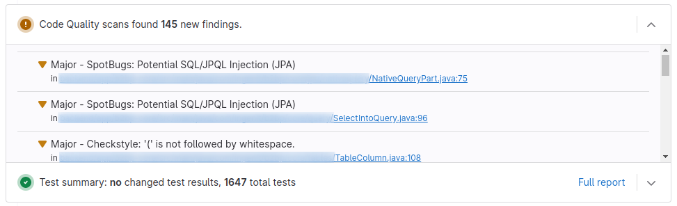

= gitlab-code-quality-plugin
:version_stable: 1.0.0-SNAPSHOT
:version_snapshot: 1.0.0-SNAPSHOT

This Maven plugin allows you to transform XML reports created by code quality tools like
https://spotbugs.github.io/[SpotBugs] and https://checkstyle.org/[Checkstyle]
into a JSON format supported by https://about.gitlab.com/[GitLab] to displayed
identified issues in the merge request widget.

== Usage

As this plugin processes XML reports of other code quality tools, you have to set up
the Maven plugins for SpotBugs and Checkstyle yourself before adding the plugin.

Then, just add the following plugin definition to your `pom.xml`:

[source,xml,subs="+attributes"]
----
<project>

  <build>
    <plugins>

      <!-- ====================================================== -->
      <!--  maven-checkstyle-plugin, spotbugs-maven-plugin, etc.  -->
      <!-- ====================================================== -->

      <plugin>
        <groupId>de.chkal.maven</groupId>
        <artifactId>gitlab-code-quality-plugin</artifactId>
        <version>{version_stable}</version>
        <executions>
          <execution>
            <goals>
              <goal>generate</goal>
            </goals>
          </execution>
        </executions>
      </plugin>

    </plugins>
  </build>
</project>
----

Without any explicit configuration, the plugin will look for XML reports in the following locations:

* `target/spotbugsXml.xml`
* `target/checkstyle-result.xml`

If corresponding XML files are found and contain at least one issue, the plugin will
generate the following JSON file:

* `target/gl-code-quality-report.json`

Now you will have to tell GitLab about this file by modifying your `.gitlab-ci.yml` file like this:

[source,yaml]
----
build:
  stage: build
  image: ...
  script:
    - ...
  artifacts:
    reports:
      codequality:
        - target/gl-code-quality-report.json
----

With these changes, GitLab will show all findings in the merge request widget.

== Advanced configuration

In most cases, no explicit configuration of the plugin is required.
But depending on your needs, fine-tuning the configuration may be valuable.

The following example shows all available configuration parameters with their
default values:

[source,xml,subs="+attributes"]
----
<project>

  <build>
    <plugins>

      <!-- ====================================================== -->
      <!--  maven-checkstyle-plugin, spotbugs-maven-plugin, etc.  -->
      <!-- ====================================================== -->

      <plugin>
        <groupId>de.chkal.maven</groupId>
        <artifactId>gitlab-code-quality-plugin</artifactId>
        <version>{version_stable}</version>
        <executions>
          <execution>
            <goals>
              <goal>generate</goal>
            </goals>
          </execution>
        </executions>
        <configuration>

          <!-- Whether to enable support for SpotBugs -->
          <spotbugsEnabled>true</spotbugsEnabled>

          <!-- Location of the SpotBugs XML report -->
          <spotbugsInputFile>${project.build.directory}/spotbugsXml.xml</spotbugsInputFile>

          <!-- Whether to enable support for Checkstyle -->
          <checkstyleEnabled>true</checkstyleEnabled>

          <!-- Location of the Checkstyle XML report -->
          <checkstyleInputFile>${project.build.directory}/checkstyle-result.xml</checkstyleInputFile>

          <!-- Location of the JSON output file -->
          <outputFile>${project.build.directory}/gl-code-quality-report.json</outputFile>

        </configuration>
      </plugin>

    </plugins>
  </build>
</project>
----

== Multi-module configuration

If you want to use this plugin in a Maven multi-module project, you can simply add the plugin
to one of the parent POMs which ensures that the plugin is invoked for all reactor modules.
This will create one JSON output file for each module.

Unfortunately, GitLab only supports a single code quality JSON file per job
(see https://gitlab.com/gitlab-org/gitlab/-/issues/9014[this issues] for details).
To work around this limitation, you can use https://stedolan.github.io/jq/[jq] in your
pipeline to merge all JSON reports into a single one and use this instead.

See the following pipeline definition for an example:

[source,yaml]
----
build:
  stage: build
  image: ...
  before_script:
    - apt-get update && apt-get install -y jq
  script:
    - ...
  after_script:
    - find . -name gl-code-quality-report.json -print | xargs cat | jq -s "add" > merged-gl-code-quality-report.json
  artifacts:
    reports:
      codequality:
        - merged-gl-code-quality-report.json
----

== Using the latest snapshots

The latest snapshots of this plugin are deployed to the Sonatype OSSRH repository.
To use these latest snapshots, you will have to modify your `pom.xml` like this:

[source,xml,subs="+attributes"]
----
<project>

  <build>
    <plugins>

      <!-- ====================================================== -->
      <!--  maven-checkstyle-plugin, spotbugs-maven-plugin, etc.  -->
      <!-- ====================================================== -->

      <plugin>
        <groupId>de.chkal.maven</groupId>
        <artifactId>gitlab-code-quality-plugin</artifactId>
        <version>{version_snapshot}</version>
        <executions>
          <execution>
            <goals>
              <goal>generate</goal>
            </goals>
          </execution>
        </executions>
      </plugin>

    </plugins>
  </build>

  <!-- Sonatype snapshots for plugins -->
  <pluginRepositories>
    <pluginRepository>
      <id>sonatype-ossrh-snapshots</id>
      <url>https://oss.sonatype.org/content/repositories/snapshots</url>
    </pluginRepository>
  </pluginRepositories>

</project>
----